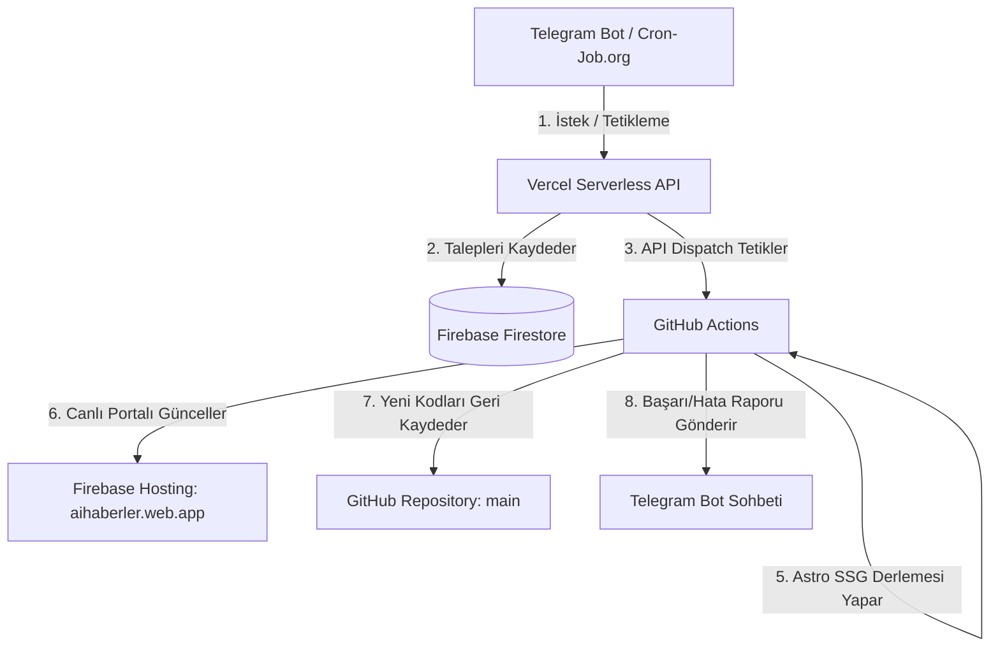

# AIHABERLER Otonom Haber Portalı & Telegram Botu Proje Mimarisi (PROJECT_OVERVIEW.md)

Bu dosya; projenin mimarisini, işleyiş mantığını, otonom bulut zamanlayıcısını, hata toleransı standartlarını ve sonraki yapay zeka asistanlarının/geliştiricilerin projeyi sıfır kayıpla sürdürebilmesi için gerekli tüm bilgileri barındıran **resmi mimari kılavuzdur.**

---

## 1. Proje Genel Tanımı & Canlı Site Bilgileri

* **Canlı Web Portalı (Front-End & Reklamlar):** [https://aihaberler.web.app](https://aihaberler.web.app)
  * **Barındırma:** Firebase Hosting (Free Tier)
  * **Teknoloji:** Astro Framework (Static Site Generation - SSG)
  * **Reklam Modeli:** Google AdSense ve AdMob entegrasyonu tamamen bu canlı portal üzerinde kuruludur. Kullanıcıların ziyaret ettiği ve gelir üreten asıl katmandır.
* **Serverless Backend (Bot API & Webhook):** [https://ai-haber-portali.vercel.app](https://ai-haber-portali.vercel.app)
  * **Barındırma:** Vercel (Hobby / Free Tier)
  * **Teknoloji:** Python Serverless Functions (`api/webhook.py`, `api/cron.py`)
  * **Görev:** Telegram bot isteklerini dinlemek ve otonom bulut tetikleyicilerini yönetmek için kullanılan API katmanıdır. Doğrudan kullanıcı ziyareti veya reklam içermez.

---

## 2. Uçtan Uca Otonom Bulut Mimarisi & İş Akışı

Sistem, 7/24 açık fiziki bir sunucuya (PythonAnywhere, AWS EC2 vb.) ihtiyaç duymadan, olay tetiklemeli ve tamamen ücretsiz bulut katmanları (Vercel, GitHub Actions, Firebase) üzerinde kurulmuştur:



### Detaylı Adım Adım İşleyiş Sırası:
1. **Tetikleme:** Zamanı geldiğinde bulut zamanlayıcısı veya Telegram'dan kullanıcı `/tara` ya da bir konu başlığı gönderir.
2. **Serverless Karşılama:** Vercel `/api/webhook` veya `/api/cron` API'si isteği yakalar, özel haber talebiyse Firestore kuyruğuna kaydeder.
3. **Sunucu Uyandırma:** Vercel, `GITHUB_PAT` kullanarak GitHub Actions API'sini anında tetikler.
4. **Hazırlık:** GitHub Actions bulutta geçici bir sanal sunucu hazırlar, Python & Node.js ortamını kurar.
5. **Haber Üretimi (Python):** `main.py` çalışır. RSS sitelerini tarar ve Firestore'daki bekleyen özel haber konularını **Gemini AI Grounding** (internet araması destekli yapay zeka) ile araştırarak SEO uyumlu, görselleştirilmiş markdown haberleri üretir.
6. **Web Derlemesi (Astro):** Yeni eklenen haberlerle birlikte Astro web sitesi `npm run build` ile static olarak saniyeler içinde derlenir.
7. **Canlı Yayın Dağıtımı:** Derlenen static HTML/CSS çıktıları doğrudan **Firebase Hosting**'e deploy edilerek `aihaberler.web.app` üzerinde anında canlıya alınır.
8. **Geri Yazma (Push):** Üretilen haber dosyaları (`.md` ve görseller) GitHub Actions tarafından yazarın doğrulanmış e-postası (`kemaleris8391@gmail.com`) ile depoya geri push edilir.
9. **Raporlama:** Tüm sürecin başarı/hata durum raporu ve haber linkleri Telegram üzerinden doğrudan yöneticiye gönderilir.

---

## 3. Garanti Zamanlı Otonom Döngü (Cron-Job.org & Vercel)

Vercel Hobby hesaplarındaki günlük maksimum 1 cron çalıştırma sınırını ve GitHub Actions'ın ücretsiz `schedule` (cron) tetikleyicilerindeki 3-4 saatlik keyfi gecikmeleri aşmak için **Garanti Zamanlı Otonom Tetikleyici** kurulmuştur:

* **Tetikleyici Servis:** [Cron-Job.org](https://cron-job.org) (Tamamen Ücretsiz)
* **Hedef Uç Noktası (URL):** `https://ai-haber-portali.vercel.app/api/cron`
* **Çalışma Prensibi:**
  1. `Cron-Job.org` her 10 veya 20 dakikada bir milimetrik doğrulukla Vercel API'mizi tetikler (GET isteği atar).
  2. Vercel uyanır, Firestore'dan sizin bota girdiğiniz süreyi (Örn: `/sure 60` ile 1 saat) ve son çalışma zamanını okur.
  3. Süre dolduysa, Vercel **GitHub Actions'ı anında tetikler** ve Firestore kilidini `is_running=True` yapar.
  4. Süre dolmadıysa kotaları harcamamak için 500ms içinde sessizce kapanır.

---

## 4. Semantik Başlık Benzerliği Filtresi & İnteraktif Mükerrer Tarayıcı

Aynı konunun farklı RSS kaynakları tarafından farklı linklerle yayınlanması durumunda oluşabilecek **mükerrer içerik kirliliğini** ve gereksiz AI API kullanımını önlemek amacıyla **Semantik Başlık Filtresi (Jaccard Similarity)** ve **İnteraktif Mükerrer Haber Tarayıcısı** entegre edilmiştir.

### A. Otomatik Filtreleme (Fetcher Tarafı):
1. Python `fetcher.py` taramaya başlamadan önce doğrudan `web-portal/src/content/blog` klasöründeki tüm aktif `.md` haber dosyalarını okur ve sitemizde **hali hazırda yayınlanmış olan tüm haberlerin başlıklarını** canlı olarak belleğe yükler.
2. RSS'ten gelen yeni bir haber başlığındaki Türkçe karakterleri normalize eder, noktalama işaretlerini kaldırır ve bağlaçları (ve, veya, bir, ile vb.) temizleyerek anahtar kelimeleri çıkarır.
3. Yeni haber başlığının, sitemizdeki tüm başlıklarla olan ortak kelime kesişim oranını (benzerliğini) hesaplar.
4. **Benzerlik Oranı >= %40** (veya benzerlik algoritması eşiği) ise, sistem bu haberi *"Aynı konu zaten sitemizde yayınlanmış!"* diyerek **akıllıca es geçer ve eler.**

### B. İnteraktif Mükerrer Tarayıcı ve Silme İş Akışı (Telegram Bot Tarafı):
Yönetici Telegram panelinden `🔍 Benzer Haber Ara` butonuna tıkladığında aşağıdaki akış çalışır:
1. **Semantik Analiz:** Bot, son 50 haberin başlıklarını ve yayınlanma tarihlerini (`pubDateTime`) analiz eder. Eşik değerini aşan haberleri gruplar.
2. **Orjinal Haber Koruması:** Her gruptaki haberler yayınlanma zamanına göre (`pubDateTime` saat/dakika hassasiyetiyle) kronolojik olarak sıralanır.
   - En erken yayınlanan haber **`✅ İLK HABER (ORJİNAL)`** olarak işaretlenir.
   - Bu orijinal haber koruma altına alınır ve sistem tarafından silinmesine izin verilmez (silme butonu oluşturulmaz).
3. **Mükerrer Listeleme:** Sonradan yayınlanan kopya haberler, altında interaktif silme butonlarıyla listelenir. Buton metinleri `🗑️ [31 May 00:53] Haber Başlığı` formatında tarih ve saati içerecek şekilde düzenlenir.
4. **Güvenli Silme Onayı (Confirm Flow):** Silme butonuna basıldığında *"Haberi silmek istediğinizden emin misiniz?"* şeklinde Evet/Hayır onay menüsü gelir.
5. **Temiz Silme Döngüsü:** Silme işlemi onaylandığında:
   - İlgili `.md` haber dosyası ve ilişkili kapak resmi yerel depodan silinir.
   - Firestore üzerindeki haber indeks tablosu (`rebuild_posts_index`) güncellenir.
   - Değişiklikler otomatik olarak GitHub deposuna commit & push edilir (Vercel bunu algılayıp otomatik olarak canlı siteyi yeniden derler).
   - **Kritik Kural:** Silme işleminden sonra bulut taraması tetiklenmesini önlemek için `trigger_github_workflow()` işlevi **kesinlikle tetiklenmez**, böylece gereksiz RSS döngüleri ve API kotaları tüketilmez.

---

## 5. Çevre Değişkenleri (Environment Variables / Secrets)

Sistemin kararlı çalışabilmesi için **hem Vercel panelinde hem de GitHub Repository Secrets panelinde** aşağıdaki çevre değişkenlerinin eksiksiz tanımlanması zorunludur:

| Değişken Adı | Açıklama / İçerik |
| :--- | :--- |
| `TELEGRAM_BOT_TOKEN` | Telegram botunuzun token anahtarı (HTTP API). |
| `TELEGRAM_CHAT_ID` | Botun raporları göndereceği yöneticinin Chat ID'si. |
| `GITHUB_PAT` | GitHub Actions'ı dışarıdan tetikleyebilmek için üretilen Kişisel Erişim Anahtarı (Personal Access Token). |
| `FIREBASE_SERVICE_ACCOUNT_JSON` | Firebase Firestore ve Hosting yetkilendirmesi için kullanılan Servis Hesabı JSON içeriğinin tamamı. |
| `GEMINI_API_KEYS` | Gemini API anahtarları. Kota/Sınır aşımında çökmemek için **virgülle ayrılarak** birden fazla yedek anahtar eklenebilir. |
| `PEXELS_API_KEY` | Haberlere telifsiz kapak görselleri üretebilmek için kullanılan Pexels API anahtarı. |
| `PUBLIC_ADSENSE_CLIENT_ID` | Astro derlemesinde reklamları aktif etmek için kullanılan Google AdSense Client ID. |

---

## 6. AdMob & AdSense Reklam Yapılandırması (Kural 12 Uyumu)

Mobil ve Web arayüzlerinde kullanılan Google reklam birimlerinin yapılandırılması aşağıdaki kimliklere göre koordine edilir. Üretime geçerken test anahtarları kesinlikle gerçek anahtarlarla değiştirilmelidir:

### AdSense (Web) Yapılandırması:
* **Test Client ID:** `ca-pub-3940256099942544` (Test reklamları için)
* **Gerçek AdSense ID:** `ca-pub-[KULLANICI_ADSENSE_ID]` (Canlı reklamlar için)

### AdMob (Mobil - Gelecek Planı) Yapılandırması:
* **Test Banner Ad Unit ID:** `ca-app-pub-3940256099942544/6300978111`
* **Test Interstitial Ad Unit ID:** `ca-app-pub-3940256099942544/1033173712`
* **Test Rewarded Ad Unit ID:** `ca-app-pub-3940256099942544/5224354917`

---

## 7. Firestore Veritabanı Şeması

Firestore üzerinde kullanılan koleksiyonlar ve belge yapıları şöyledir:

### `system_config` Koleksiyonu:
* Belge: **`scheduler`**
  * `interval_minutes` (number): Otomatik tarama aralığı (Varsayılan: 20).
  * `last_run_time` (timestamp): En son başarılı haber taramasının yapıldığı zaman damgası.
  * `is_running` (boolean): Bulut sunucusunun o an tarama/derleme yapıp yapmadığını belirten kilit bayrağı (lock).

### `custom_requests` Koleksiyonu:
* Belgeler: Otomatik üretilen ID'ler.
  * `topic` (string): Kullanıcının talep ettiği haber konusu başlığı.
  * `status` (string): `"pending"` (beklemede) veya `"completed"` (tamamlandı).
  * `requested_at` (number): Zaman damgası.

### `rss_sources` Koleksiyonu:
* Belgeler: `webtekno`, `shiftdelete` vb.
  * `name` (string): Kaynak ismi.
  * `url` (string): RSS Besleme adresi.
  * `category` (string): `"teknoloji"`, `"oyun"`, `"dizi-film"` veya `"kuantum-evreni"`.

---

## 8. Sonraki Geliştiriciler & AI Asistanları İçin Önemli Notlar

1. **Firestore Sorgularında İndeks Engeli Bypası:** `custom_requests` sorgusunda composite index hatasını önlemek için veritabanından sadece basit filtre (`status == 'pending'`) ile çekim yapın, tarih bazlı sıralamaları her zaman **Python/bellek tarafında** çözün:
   `requests_list.sort(key=lambda x: x.get("requested_at", 0))`
2. **Git Commit Kimliği:** GitHub Actions içinde haber push edilirken, Vercel'in yazar doğrulama engeline (`Blocked`) takılmaması için commit yazar e-postası kesinlikle **`kemaleris8391@gmail.com`** ve kullanıcı adı **`kemaleris8391-dev`** olmalıdır.
3. **Statik Çekim Standardı:** Vercel serverless ve stateless olduğu için, `/durum` sorgusunda toplam haber sayısını local klasörden okuyamaz (klasör o an boştur). Bu nedenle toplam haber sayısını her zaman **GitHub Contents API** üzerinden dinamik olarak sorgulayın.
4. **Önbellek ve .gitignore Kuralları:** Python derleme önbellek dosyaları (`*.pyc` ve `__pycache__/`) kesinlikle git takibine girmemelidir. Projede bu dosyaların yanlışlıkla depolanmasını önlemek amacıyla `.gitignore` içerisine global `**/__pycache__/` ve `**/*.pyc` kuralları yerleştirilmiştir. Yanlışlıkla takibe alınan dosyalar olursa `git rm -r --cached [yol]` komutu ile indeks temizlenmelidir.

---

## 9. Yapay Zeka Asistanının Tam Yetkili ve Otonom Çalışma Protokolü

* **Tam Yetki ve Sıfır Sürtünme İlkesi:** Yapay zeka asistanı, kullanıcının GitHub reposu, Vercel paneli ve Firestore bulut konfigürasyonları üzerindeki tüm otonom dağıtım, terminal komutu çalıştırma ve kod güncelleme işlemlerinde **tam yetkilidir.**
* **Otonom Git ve Dağıtım Yönetimi:** Asistan, kod dosyalarında değişiklik veya yerel temizlik yaptıktan sonra kullanıcıya herhangi bir terminal komutu çalıştırma görevi (örn: `git add`, `git push`, `npm run build` vb.) bırakmamalıdır. Gerekli tüm `git add`, `git commit`, `git pull --rebase` ve `git push` adımlarını terminal üzerinden kendisi otonom olarak koşturup sistemi doğrudan canlıya almalıdır.
* **Canlı Takip ve Raporlama:** Dağıtım ve çalıştırma süreçleri tamamlandıktan sonra kullanıcıya sadece sürecin nihai başarı/hata durum raporu ve yapılması gereken testler sunulmalıdır. Bu süreç kararlılığı, projenin sürdürülebilirliği ve otonom karakteri için tavizsiz bir kuraldır.

---

## 10. Vercel CI/CD & Canlı Dağıtım Protokolü (Monorepo Standardı)

Bu projede Vercel hesabı altında iki farklı proje tanımlıdır ve dağıtımların çakışmaması, botun hata vermemesi için aşağıdaki kurallara milimetrik olarak uyulmalıdır:

### Vercel Proje Yapısı:
1. **`web-portal`** (Önizleme / Taslak Proje): `https://web-portal-ashen.vercel.app` adresine bağlıdır. Yerel `web-portal` alt dizininden deploy edilir. Canlı botu tetiklemez!
2. **`ai-haber-portali`** (Esas Canlı Proje): `https://ai-haber-portali.vercel.app` adresine bağlıdır ve Telegram Webhook'unun istek gönderdiği **canlı üretim sunucusudur.**

### ⚠️ Kritik Canlı Dağıtım (Deploy) Kuralları:
Otomatik GitHub Action veya Vercel tetikleyicilerinde gecikme veya kilitlenme yaşanması durumunda, en son serverless backend (`webhook.py`, `cron.py`) değişikliklerini canlı bota **kesin ve güvenli olarak yansıtmak için** Vercel CLI elle tetiklenmelidir:

1. **Root Dizin Zorunluluğu:** 
   Vercel'deki `ai-haber-portali` projesinin Root Directory ayarı `web-portal` olarak yapılandırılmıştır. Bu nedenle Vercel CLI komutları **kesinlikle `web-portal` alt dizininden değil, projenin en üst (ROOT) ana dizininden (`ai-haber-portali`) çalıştırılmalıdır!** (Alt dizinden çalıştırılırsa Vercel monorepo klasör yapısı bozulur ve `web-portal/web-portal bulunamadı` hatası verir).

2. **Esas Projeye Bağlama (Linkleme) Komutu (Ana dizinde bir kez çalıştırılır):**
   ```bash
   vercel link --yes --scope kemaleris8391-4361s-projects --project ai-haber-portali
   ```

3. **Canlıya Dağıtım (Deploy) Komutu (Ana dizinde çalıştırılır):**
   ```bash
   vercel --prod --yes
   ```

Bu mimari standart, Telegram botunda ve veritabanı işlemlerinde *"difflib is not defined"* veya sunucu senkronizasyon hataları yaşanmasını %100 önlemek için tasarlanmıştır.

---

## 11. Google Keşfet (Google Discover) Uyum Standartları

Bu portalın birincil trafik kaynağı **Google Keşfet** (Google Discover) olarak hedeflenmiştir. Keşfet algoritmalarına uyum sağlamak ve elenmemek için aşağıdaki teknik ve içerik kuralları zorunlu olarak uygulanmaktadır:

### A. Görsel Boyut Standartları (En Kritik Kural):
* **Min. 1200px Genişlik:** Google Keşfet, akışta kartların büyük görünmesi için görsellerin **en az 1200 piksel genişliğinde** olmasını şart koşar.
* **Pexels Entegrasyonu:** `ai_writer.py` içindeki `fetch_pexels_image` fonksiyonu, görselleri Pexels API'sinden `"large2x"` (1880px genişlik) modunda çekerek bu kuralı %100 karşılar.
* **Robots Meta Etiketi:** `Layout.astro` içinde `<meta name="robots" content="index, follow, max-image-preview:large" />` etiketi eklenmiştir. Bu etiket olmadan Google Keşfet büyük resimleri akışta göstermez.

### B. Yapılandırılmış Veri (Schema Markup):
* **NewsArticle Şeması:** Haber sayfalarında Google'ın haber sitelerinden beklediği resmi `NewsArticle` (JSON-LD) şeması otomatik olarak basılmaktadır. İçerisinde başlık, açıklama, yayınlanma tarihi, logo ve yazar bilgileri eksiksiz yer alır.

### C. Başlık ve İçerik Etiği (Clickbait Engeli):
* **Doğru Başlıklar:** Gemini yazım yönergelerinde clickbait (tık tuzağı) başlıklar kesinlikle yasaklanmış; merak uyandıran ama yanıltıcı olmayan başlık kalıpları tanımlanmıştır.
* **Bilgi Güvenilirliği (Zero Fabrication):** Google Discover'ın yanıltıcı içerik filtrelerine takılmamak adına, haber yazımında uydurma veri/tarih üretimi engellenmiş, kaynağa sadakat zorunlu kılınmıştır.

### D. Teknik Altyapı ve İndeksleme Hızı:
* **Otomatik Sitemap Entegrasyonu:** `@astrojs/sitemap` kütüphanesi aktif edilmiştir. Her site derlemesinde (`npm run build`), yeni eklenen haberler de dâhil olmak üzere tüm sayfalar otomatik olarak `sitemap-index.xml` dosyasına eklenir.
* **robots.txt Dosyası:** Sitenin kök dizininde `robots.txt` yapılandırılarak Google botlarına güncel sitemap adresi (`https://aihaberler.web.app/sitemap-index.xml`) bildirilmiştir. Bu sayede yeni haberler arama motorları tarafından anında taranıp Keşfet'e sunulur.

---

## 12. Google Discover & E-E-A-T ve Kategori / Dağıtım Güncellemeleri (Haziran 2026)

Bu bölümde, son geliştirme seansında Google Discover uyumu, E-E-A-T (Deneyim, Uzmanlık, Yetkinlik, Güvenilirlik) kuralları ve portal altyapısını güçlendirmek adına eklenen yenilikler özetlenmiştir:

### A. Türkçe Dil ve Çeviri Hassasiyeti:
* `ai_writer.py` içindeki tüm yazım promptları (`rewrite_news_with_ai` ve `research_topic_with_gemini`) güncellenmiştir. Girdi haberi İngilizce olduğunda, sistem **anlam kaybı olmaksızın içeriği tamamen Türkçe'ye çevirir.** Gerekli yerlerde teknik terminoloji (CPU, pipeline vb.) korunurken genel dilin akıcı ve Türkçe olması zorunlu hale getirilmiştir.

### B. Yeni Kategori: Kuantum Evreni
* Arayüze ve veri tabanına `kuantum-evreni` ("Kuantum Evreni") kategorisi eklendi. `Layout.astro` ve `[category].astro` dosyalarındaki menü ve kategori tanımları güncellendi. Artık kuantum fiziği, kuantum bilgisayarları ve teknolojileriyle ilgili haberler otomatik olarak bu kategoriye yerleşmekte ve statik sayfası derlenmektedir.

### C. E-E-A-T Kurumsal Sayfaları ve Altyapı Entegrasyonları:
* **WebSub (PubSubHubbub) Entegrasyonu:** Yeni haberlerin Google tarafından anında indekslenmesi için `/rss.xml.js` API rotası oluşturuldu ve Google'ın resmi WebSub Hub adresi (`https://pubsubhubbub.appspot.com/`) entegre edildi. 
* **Otomatik Hub Bildirimi (Ping):** Firebase Hosting deploy işlemi başarıyla tamamlandığında `notify_pipeline_status.py` betiği üzerinden Google WebSub Hub sunucusuna otomatik olarak `hub.mode=publish` ping bildirimi atılması sağlandı.
* **E-E-A-T Kurumsal Sayfaları:** Kalite standartları gereği zorunlu olan `/hakkimizda` (Hakkımızda), `/iletisim` (İletişim - `kemaleris8391@gmail.com`), `/editoryal-ilkeler` (Yayın ve AI kullanım ilkeleri), `/privacy-policy.html` (Gizlilik Politikası) ve `/yazar/editoryal-ekip` (Yazar künyesi) sayfaları eklenerek sitenin Footer bölümüne eklendi.
* **CLS ve LCP Optimizasyonları:** Haber detay sayfalarında (`[...slug].astro`) Largest Contentful Paint (LCP) performansını artırmak için kapak görsellerine sabit genişlik/yükseklik (`width="1200" height="675"`) ve `fetchpriority="high"` öznitelikleri verilerek Cumulative Layout Shift (CLS) kaymaları sıfırlanmıştır.

### D. Dinamik SITE_URL Desteği:
* `web-portal/astro.config.mjs` dosyasındaki `site` parametresi `process.env.SITE_URL` çevre değişkenine bağlandı. Vercel veya diğer CI/CD platformlarında derleme yaparken `SITE_URL` tanımlanması durumunda (Örn: Vercel için `SITE_URL=https://ai-haber-portali.vercel.app`), sitemap ve canonical linklerin Vercel domainine göre derlenmesi sağlandı.

### E. GitHub Actions Push Tetikleme İyileştirmesi:
* `.github/workflows/autonomous_rss.yml` dosyasına `push` olay tetikleyicisi eklendi. Artık sisteme bir kod değişikliği (Astro dosyaları veya workflow yapılandırması) pushlandığında, **yeni haber üretilmemiş olsa bile Firebase Hosting'e deploy yapılması (Astro Build + Deploy) koşulsuz olarak tetiklenmektedir.**

---

## 13. Gizlilik Geçişi, Model Fallback ve "Editörün Kalemi" Güncellemeleri (Haziran 2026)

Bu bölümde, projenin güvenlik yapısını artırmak, LLM model başarısını yükseltmek ve kullanıcıya özel içerikleri ayırmak adına son seanslarda gerçekleştirilen kritik yapısal ve mimari güncellemeler özetlenmiştir:

### A. Firebase Gizlilik Geçişi & Firestore Entegrasyonu:
* **Hassas Verilerin Taşınması:** Sistem promptları (haber özgünleştirme, semantik filtre vb.), marka isimleri, e-posta adresleri gibi gizli olması gereken tüm veriler kod tabanından tamamen temizlenerek Firebase Firestore veritabanına (`system_config/site_settings` ve `system_config/gemini_prompts` belgelerine) taşınmıştır.
* **Dinamik Ortam İhracatçısı (`export_env_from_firestore.py`):** GitHub Actions veya yerel sunucu her çalışmaya başladığında, Firestore'a bağlanarak bu gizli ayarları çeker ve `.gitignore` içinde korunan geçici `.env` ve `prompts_config.json` dosyalarını dinamik olarak oluşturur.
* **Çalışma Sırası İyileştirmesi:** Actions iş akışındaki (`autonomous_rss.yml`) okuma hatalarını önlemek için bu ihracat adımının RSS & AI Pipeline adımından **ÖNCE** çalışması sağlanmıştır.
* **Yerel Senkronizasyon (`run_pipeline.bat`):** Yerel testlerin bulutla birebir aynı çalışabilmesi amacıyla, yerel betiğe de `export_env_from_firestore.py` adımı entegre edilmiş, internet kesintilerinde yerel önbellek dosyalarıyla devam edebilen hata toleransı eklenmiştir.

### B. Birincil Model Gemma 4 31B & Model Fallback Döngüsü:
* **Birincil Model:** Haber yazımı ve semantik mükerrer filtreleme işlemlerinde en güncel ve kararlı model olan **`gemma-4-31b-it`** modeli birincil olarak ayarlanmıştır.
* **Model Fallback (Yedek Döngü):** Birincil modelde kota veya API hatası alınması durumunda sistemin çökmesini engellemek için sırasıyla **`gemma-4-26b-a4b-it`** ve **`gemma-4-26b-it`** modellerine otomatik sığınan (fallback) bir döngü mekanizması entegre edilmiştir.
* **Düşünme Yapılandırması (`ThinkingConfig`):** Haber kalitesini artırmak için modellere **`thinking_config (thinking_level=HIGH)`** yeteneği eklenmiştir. Uyumsuz modellerde bu özelliğin otomatik devre dışı kalmasını sağlayan hata toleransı kurulmuştur.

### C. Sıfır Secrets AdSense Entegrasyonu:
* **Dinamik AdSense Entegrasyonu:** AdSense yayıncı kimliğiniz (`ca-pub-1976027031672277`) GitHub Secrets yerine doğrudan Firestore `site_settings` belgesindeki `PUBLIC_ADSENSE_CLIENT_ID` alanına kaydedilmiştir.
* **Dinamik Yükleme:** Sitenin derlenmesi esnasında bu kimlik veritabanından çekilerek Astro `.env` dosyası üzerinden `Layout.astro` şablonuna otomatik olarak gömülür.
* **Otomatik Reklamlar & Boyut Uyumluluğu:** Sitenizde AdSense otomatik reklamları (Auto Ads) ve mobil boyut optimizasyonu tam uyumlu olarak aktif edilmiş durumdadır.

### D. "Editörün Kalemi" Bölümü & Özel Filtreleme:
* **Neon Gradyan Menü:** Sitenin ana navigasyon (Navbar) menüsünün en sağ tarafına (Kuantum Evreni'nin yanına), mor-cyan neon gradyan geçişli ve kalın fontlu **`★ Editörün Kalemi`** özel bağlantısı eklenmiştir.
* **Özel İstek Süzgeci:** `yazar/editoryal-ekip.astro` sayfası güncellenerek 450 otonom haber bu sayfadan tamamen temizlenmiştir. Sayfa, sadece sizin Telegram botundan yolladığınız özel konu/araştırma makalelerini (`sourceName` değeri `"Editörün Kalemi"`, `"Telegram Arama"` veya `"Telegram Araştırma"` olanlar) listeleyecek ve sayacak şekilde kurgulanmıştır.
* **Otonom Kaynak İmzalama:** `main.py` güncellenerek Telegram'dan gelen her yeni özel talebin kaynak adının otomatik olarak `"Editörün Kalemi"` olarak işaretlenmesi sağlanmıştır.

### E. Mobil Navigasyon Responsive ve Sığma İyileştirmesi (Haziran 2026):
* **Esnek ve Sınırlı Genişlik Yapısı:** Mobil ekranlarda (`max-width: 768px`) kategorilerin tam sığmaması, taşması veya "Ana Sayfa" bağlantısının kaydırılsa dahi görünmemesi hatası giderilmiştir.
* **Flexbox Min-Width ve Stretch Düzeltmesi:** `.nav-links` (kategori listesi) öğesine `min-width: 0;`, `max-width: 100%;` ve `align-self: stretch;` uygulanarak üst `.navbar` öğesinin ortalama (`align-items: center`) hizalamasından ötürü her iki yana taşarak "Ana Sayfa"yı sol dışa kilitleme hatası çözülmüştür.
* **Bileşen Küçülmesi (Squishing) Engeli:** Liste elemanlarına (`.nav-links li`) `flex-shrink: 0;` verilerek yazılarının ekrana sığdırılmaya çalışılırken ezilmesi engellenmiş, doğal genişliklerinde yatayda pürüzsüz kayması (`overflow-x: auto`) sağlanmıştır.

### F. Manuel Tetikleyici Kilit Aşımı ve Hayalet İşlemlerin Temizlenmesi (Haziran 2026):
* **Firestore Kilit Zaman Aşımı:** `/tara` veya `/ototemizleme` manuel tetiklemelerinde, bir önceki işlemin yarıda kalması (çökme veya yarıda durdurulma) durumunda `is_running` kilidinin Firestore'da sürekli `True` olarak kilitli kalma hatası çözülmüştür. Vercel backend API'sine kilit kontrolünde 15 dakikalık zaman aşımı (`elapsed_minutes >= 15.0`) eklenmiş, bu süreyi aşan kilitler otomatik olarak sıfırlanarak yeni işlemlerin önü açılmıştır.
* **GitHub Actions Hayalet İş (Ghost Run) Engeli:** GitHub API'sinin, tamamlanmış veya iptal edilmiş bazı Actions işlerini hâlâ `in_progress` veya `queued` statüsünde göstermesinden kaynaklanan manuel tetikleme engeli aşılmıştır. API'den dönen aktif işler taranırken, oluşturulma zamanı 20 dakikadan eski olan (`elapsed_run_minutes >= 20.0`) "hayalet" işler hesaba katılmayarak tetikleyicinin sorunsuz çalışması garanti altına alınmıştır.
* **GitHub Inputs Format Desteği:** `autonomous_rss.yml` Actions dosyasındaki boolean/string inputs kontrol yapısı genişletilerek `cleanup` ve `force` girdilerinin hem küçük/büyük harf (`true`/`True`) hem de veri tipi dönüşümlerinden kaynaklanan hatalarda dahi temizlik komutunu (`--cleanup`) doğru tetiklemesi sağlanmıştır.

---

## 14. Otonom Temizlik Performansı, Jaccard Ön-Filtresi ve Astro Derleme Önbellekleme (Haziran 2026)

Bu bölümde, otonom haber portalının temizlik ve derleme süreçlerini daha kararlı, hızlı ve maliyetsiz hale getirmek amacıyla hem GitHub Actions hem de Python otonom temizlik scriptleri üzerinde yapılan kapsamlı optimizasyonlar belgelenmiştir:

### A. Astro Derleme Önbellekleme (Astro Build Cache):
* **Actions Cache Entegrasyonu:** `.github/workflows/autonomous_rss.yml` dosyasına `actions/cache@v4` adımı entegre edilmiştir.
* **Önbellek Yolları:** Astro derleme çıktıları (`web-portal/.astro`) ve bağımlılık önbellekleri (`web-portal/node_modules/.cache`) saklanmaktadır.
* **Sonuç:** Astro projesinin statik sayfaları sıfırdan derlemek yerine önbellekten beslenmesi sağlanmış, bu sayede bulut sunucu (GitHub Actions) çalışma süreleri **%60+ oranında kısaltılarak** 5 dakikalardan ~1.5 - 2 dakikalara çekilmiştir.

### B. Jaccard Matematiksel Benzerlik Ön-Filtresi:
* **Yerel Benzerlik Kontrolü:** `auto_cleanup.py` içerisine, haberleri yapay zekaya (Gemma) göndermeden önce çalışan kelime ve karakter tabanlı yerel bir matematiksel benzerlik filtresi (Jaccard + N-Gram) eklenmiştir.
* **Çalışma Eşikleri:** Kelime benzerlik eşiği (`word_threshold = 0.45`), karakter n-gram benzerlik eşiği (`char_threshold = 0.55`) olarak ayarlanmıştır.
* **Fayda:** Bariz kopya olan haberler (Örn: %80+ kelime çakışması) yerel olarak filtrelenip yapay zekaya gönderilmeden elenmekte, bu sayede **Gemma API maliyetleri düşürülmekte** ve işlem hızı büyük ölçüde artırılmaktadır.

### C. Çoklu Model Fallback ve Düşük Batch Boyutu:
* **Hata Toleranslı Model Fallback:** API isteklerinin takılmasını veya sunucu hatasıyla yarıda kalmasını önlemek için sırasıyla `gemma-4-31b-it`, `gemma-4-26b-a4b-it`, `gemma-4-26b-it`, `gemini-2.5-flash` ve `gemini-1.5-flash` modellerini otomatik olarak deneyen esnek bir hata kurtarma mekanizması kurulmuştur.
* **25'li Gruplama (Batch Size):** Aynı anda AI analizine gönderilen haber paket boyutu `100`'den `25`'e düşürülerek, yapay zekanın işlem sırasındaki token limitleri ve işlem süreleri optimize edilmiştir.

### D. Paralel Dosya ve Resim Silme (ThreadPoolExecutor):
* **Asenkron Disk İşlemleri:** Silinmesi kararlaştırılan haber markdown dosyaları (`.md`) ve bu haberlere ait `.webp` kapak resimleri diskten tek tek (senkron) silinmek yerine Python `concurrent.futures.ThreadPoolExecutor` ile **paralel (asenkron)** olarak kaldırılmaktadır.
* **Performans:** Yüzlerce haberin silindiği durumlarda disk G/Ç (I/O) darboğazı tamamen engellenmiştir.

### E. Gün-Sınırı Çakışma Koruması (Lookback 30 Saat):
* **Lookback Süresi Artırımı:** `fetcher.py` içindeki takvim günü bazlı haber taraması, geriye dönük rolling **30 saat** olarak güncellenmiştir.
* **Fayda:** Gece yarısı (00:00) geçişlerinde RSS beslemelerinde farklı linklerle veya farklı sitelerde yayınlanan aynı haberlerin yeni gün döngüsünde mükerrer olarak algılanması (Midnight Crossover bug) tamamen çözülmüştür.

### F. Firestore Kara Liste Veritabanı Optimizasyonu (TTL):
* **Harita (Map) Yapısı:** Firestore `blacklisted_links` veritabanı alanı, arama performansını artırmak amacıyla düz liste yerine zaman damgalı bir harita (Map) yapısına dönüştürülmüştür.
* **14 Günlük Otomatik Silme (TTL):** Kara listede bulunan linkler çekilirken 14 günden eski olanlar veritabanından **otomatik olarak temizlenmektedir.** Bu sayede veritabanının sonsuza kadar şişmesi (bloat) ve okuma yavaşlığı önlenmiştir.


