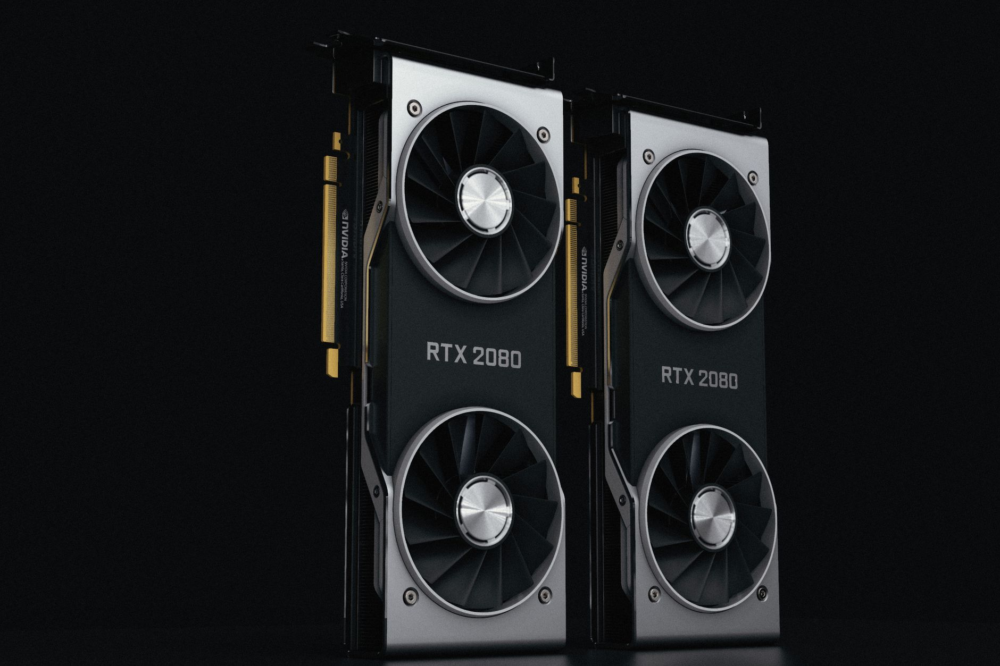
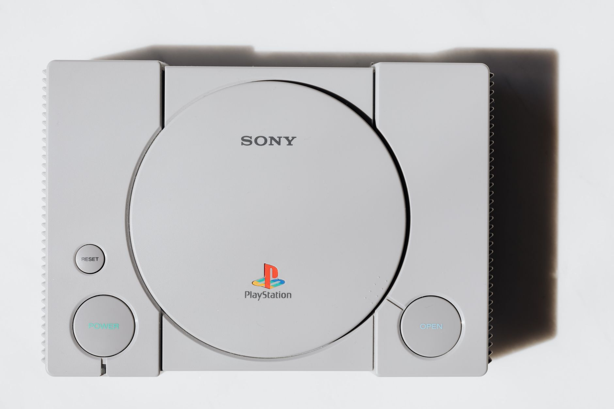
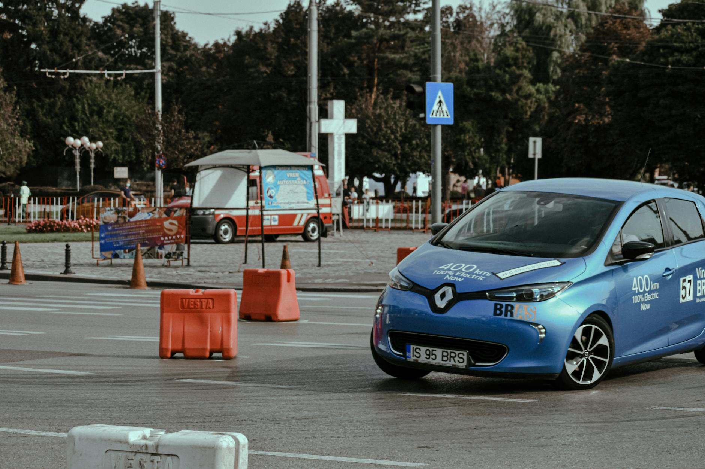
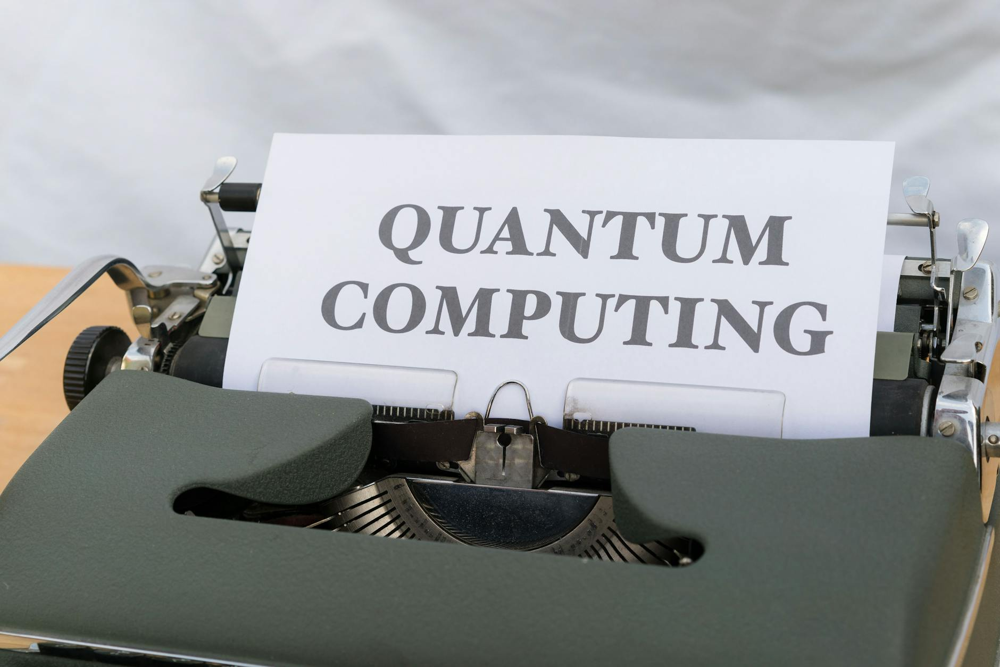

# Uyuşmazlık Bulunan Haberler ve Görseller Listesi

Bu klasör, portalda tespit edilen ve hatalı/uyumsuz görsellere sahip haberlerin orijinal dosyalarını ve eski görsellerini barındırır.

| Haber Başlığı | Orijinal MD Dosyası | Eski Görsel | Açıklama |
| :--- | :--- | :--- | :--- |
| Intel, Arc GPU’ların Geleceği Hakkında Konuştu: Stratejik Odak Korunuyor | [intel-arc-gpularin-gelecegi-hakkinda-konustu-stratejik-odak.md](intel-arc-gpularin-gelecegi-hakkinda-konustu-stratejik-odak.md) |  | Intel Arc GPU haberi olmasına rağmen NVIDIA RTX 2080 görseli içeriyor. |
| PlayStation'ın Haziran 2026 Favorileri Belli Oldu: Sony En Çok İndirilenleri Açıkladı | [playstationin-haziran-2026-favorileri-belli-oldu-sony-en-cok.md](playstationin-haziran-2026-favorileri-belli-oldu-sony-en-cok.md) |  | Güncel PS Store verileri yerine retro PlayStation 1 görseli içeriyor. |
| Volkswagen’den Erişilebilir Elektrikli Hamlesi: ID. Polo ve Cupra Raval Yollara Hazırlanıyor | [volkswagenden-erisilebilir-elektrikli-hamlesi-id-polo-ve-cup.md](volkswagenden-erisilebilir-elektrikli-hamlesi-id-polo-ve-cup.md) |  | VW/Cupra haberi olmasına rağmen Tesla fabrikası ve Lexus görseli içeriyor. |
| Volkswagen’den Sektörel Öngörü: İçten Yanmalı Motorlar Atlar Gibi Tarihe mi Karışıyor? | [volkswagenden-sektorel-ongoru-icten-yanmali-motorlar-atlar-g.md](volkswagenden-sektorel-ongoru-icten-yanmali-motorlar-atlar-g.md) |  | VW yöneticisi öngörüsü olmasına rağmen mavi Renault Zoe elektrikli aracı içeriyor. |
| Siber Güvenlikte Yeni Çağ: Katar'ın İlk Kuantum Güvenli İletişim Ağı Yayına Girdi | [siber-guvenlikte-yeni-cag-katarin-ilk-kuantum-guvenli-iletis.md](siber-guvenlikte-yeni-cag-katarin-ilk-kuantum-guvenli-iletis.md) |  | Kuantum haberi. Diğer kuantum haberi ile aynı daktilo görselini paylaşıyor (Mükerrer). |
| Microsoft Kuantum Bilgisayarları Geliştirmek İçin 'Agentic AI' Dönemini Başlattı | [microsoft-kuantum-bilgisayarlari-gelistirmek-icin-agentic-ai.md](microsoft-kuantum-bilgisayarlari-gelistirmek-icin-agentic-ai.md) |  | Kuantum haberi. Diğer kuantum haberi ile aynı daktilo görselini paylaşıyor (Mükerrer). |
